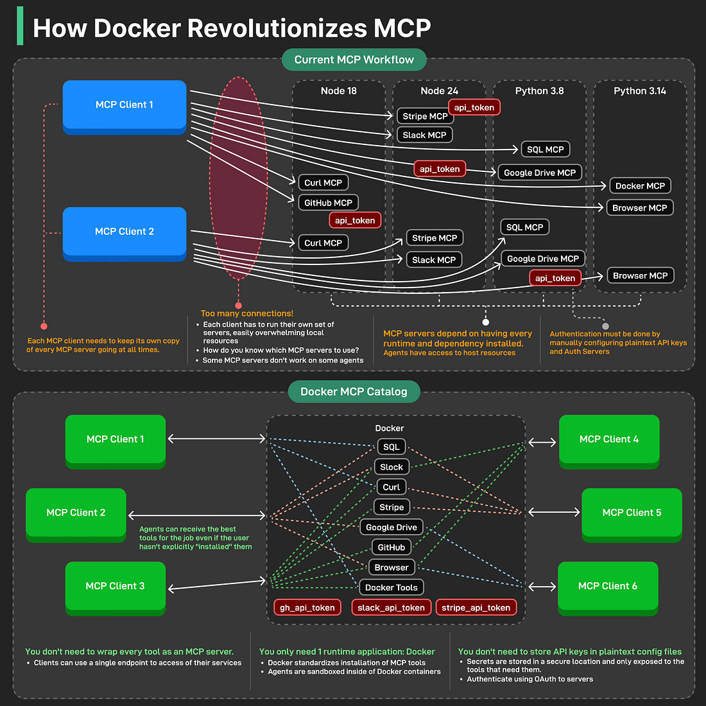

# MCP Server Docker Execution and Client Setup Guide



[Korean Version (한국어 버전)](README_KOR.md)

[Docker Blog: How to build and deliver an MCP server for production](https://www.docker.com/blog/build-to-prod-mcp-servers-with-docker/)

Problems with the Existing MCP (Model Context Protocol) Workflow

*   **Complex Management**: Each MCP client had to run its own copy of every MCP server at all times, which consumed excessive local resources. Clients had to directly configure their server sets, it was difficult to figure out which MCP servers to use, and some MCP servers had compatibility issues that prevented them from working on certain agents.
*   **Dependency Hell**: MCP servers only worked if all runtimes and dependencies were installed. Agents had direct access to host resources, which could pose security risks.
*   **Security Issues**: API keys had to be manually configured in plaintext configuration files, and authentication server management was cumbersome.

By isolating the MCP server execution environment with Docker,

*   **Simplified Runtime**: Using Docker standardizes the installation of MCP tools with a single runtime application, which can significantly reduce management overhead.
*   **Isolation and Security**: Docker containers are effective at sandboxing agents, preventing unnecessary access to host resources. Furthermore, API keys can be managed securely without being stored in plaintext configuration files, and OAuth-based server authentication can be considered to enhance security.
*   **Easy Accessibility**: Clients can access MCP services through a single endpoint, providing flexibility for agents to use suitable tools for a task even if the user hasn't explicitly installed them.


# Setup Method


## 1. Prerequisites

-   Docker must be installed. You can install it from the [Official Docker Website](https://www.docker.com/get-started).


## 2. Docker Container Execution

Launch the node20 image with Docker.

```bash
docker run -d --name mcp-server-docker -it node:20-slim bash
```

> **Note**: The container name specified with the `--name` option (`mcp-server-docker`) must be unique within the Docker host. If a container with the same name is already running or stopped, a new container cannot be started. In this case, you must stop and remove the existing container or use a different name.


## 3. MCP Client Configuration (.cursor/mcp.json Example)

MCP clients (e.g., Cursor) configure how to connect to the Context7 Documentation MCP server via the `mcp.json` file. This file is typically located in the client's configuration directory (e.g., `~/.cursor/mcp.json`) and is **not copied into the Docker container.**

This setup uses `docker exec` to directly call the MCP server script inside the container, so no separate port mapping (`-p` option) is required.

**Verifying Command Execution Inside the Container (Optional):**
To check if the MCP server is properly ready for execution inside the container, you can access the container and try running the MCP server script directly with the following commands:

```bash
docker exec -it mcp-server-docker bash
# (Inside the container) npx -y @upstash/context7-mcp@latest
# Or for a Python-based server:
# docker exec -it mcp-uv-server-docker bash
# (Inside the container) uv run /app/custom_mcp_server.py
```

You can configure the `mcp.json` file as follows to connect to the Context7 MCP Server running within the Docker container:

```json
{
    "mcpServers": {
        "Context7 MCP (Docker exec)": {
            "command": "docker",
            "args": [
                "exec",
                "-i",
                "mcp-server-docker",
                "npx",
                "-y",
                "@upstash/context7-mcp@latest"
            ]
        },
        "sequential-thinking (Docker exec)": {
            "command": "docker",
            "args": [
                "exec",
                "-i",
                "mcp-server-docker",
                "npx",
                "-y",
                "@modelcontextprotocol/server-sequential-thinking"
            ]
        }
    }
}
```


## 4. Stopping and Removing Containers (Optional)

To stop and remove containers, use the following commands:

```bash
docker stop mcp-server-docker
docker rm mcp-server-docker
```

Following this guide, you can easily deploy and configure the Context7 Documentation MCP Server in a Docker environment and utilize it with your client.


------------------


## 5. Custom Build Cases

### 5.1. Node.js Based MCP Server Custom Build

The Context7 Documentation MCP Server is Node.js based. You can build and run the server in a Node.js environment using the following `Dockerfile`.

```dockerfile
FROM node:20-slim
WORKDIR /app
CMD ["tail", "-f", "/dev/null"]
```

Build the Docker image by running the following command in the project root directory where the `Dockerfile` is located.
Tag the built image with a generic name like `node-base-image`.

```bash
docker build -t node-base-image .
```

Run the Docker container using the built image.

```bash
docker run -d --name mcp-server-docker -it node-base-image
```

-   `-d`: Runs the container in detached mode (in the background).
-   `--name mcp-server-docker`: Assigns the name `mcp-server-docker` to the container.
    > **Note**: The container name specified with the `--name` option (`mcp-server-docker`) must be unique within the Docker host. If a container with the same name is already running or stopped, a new container cannot be started. In this case, you must stop and remove the existing container or use a different name.
-   `-it`: Enables interactive mode for the container and allocates a TTY. This is useful when executing commands inside the container.
-   `node-base-image`: The name of the Docker image to run.

### 5.2. Python (`uv`) Based MCP Server Custom Build (Example)

If you are using a Python-based MCP server and managing dependencies with `uv`, you can configure a similar `Dockerfile` as follows. This example assumes that a `requirements.txt` file exists in your project root.

```dockerfile
FROM python:3.10-slim-buster
WORKDIR /app

# Install necessary system packages and clean up cache
RUN apt-get update && apt-get install -y --no-install-recommends curl tar \
    && rm -rf /var/lib/apt/lists/*

# Install uv (recommended)
# Download the latest uv binary and install it to /usr/local/bin.
RUN curl -sSfL https://astral.sh/uv/install.sh | sh \
    && mv /root/.local/bin/uv /usr/local/bin/uv

# Install dependencies
COPY requirements.txt .
RUN uv pip install -r requirements.txt --system

# Copy and build MCP server script (if necessary)
# Example: Assuming you have a file named custom_mcp_server.py
COPY custom_mcp_server.py .
# custom_mcp_server.py should be an MCP server that handles JSON-RPC requests/responses via standard input (stdin) and standard output (stdout).

CMD ["tail", "-f", "/dev/null"]
```

Build the Docker image by running the following command in the project root directory where the `Dockerfile` is located.
Tag the built image with a generic name like `python-mcp-base-image`.

```bash
docker build -t python-mcp-base-image .
```

Run the Docker container using the built image.

```bash
docker run -d --name mcp-uv-server-docker -it python-mcp-base-image
```

-   `-d`: Runs the container in detached mode (in the background).
-   `--name mcp-uv-server-docker`: Assigns the name `mcp-uv-server-docker` to the container.
-   `-it`: Enables interactive mode for the container and allocates a TTY.
-   `python-mcp-base-image`: The name of the Docker image to run.

Here's an example of `mcp.json` client configuration for running a Python-based MCP server within the container:

```json
{
    "mcpServers": {
        "Python Weather MCP (Docker exec)": {
            "command": "docker",
            "args": [
                "exec",
                "-i",
                "mcp-uv-server-docker",
                "uv",
                "run",
                "/app/custom_mcp_server.py"
            ]
        }
    }
}
```
After adding this configuration, you should restart your MCP client (e.g., Cursor) to apply the changes.

To stop and remove containers, use the following commands:

```bash
docker stop mcp-uv-server-docker
docker rm mcp-uv-server-docker
```


------------------


## 6. Troubleshooting and Debugging

If the MCP server is not working as expected, you can check the Docker container's logs to diagnose the issue.

-   **Check Container Logs**:
    ```bash
    docker logs <container_name>
    # Example:
    # docker logs mcp-server-docker
    # docker logs mcp-uv-server-docker
    ```
    This command displays all logs output by the container to standard output (stdout) and standard error (stderr) since it started. You can check the server's startup process, error messages, processed requests, and more.

------------------ 