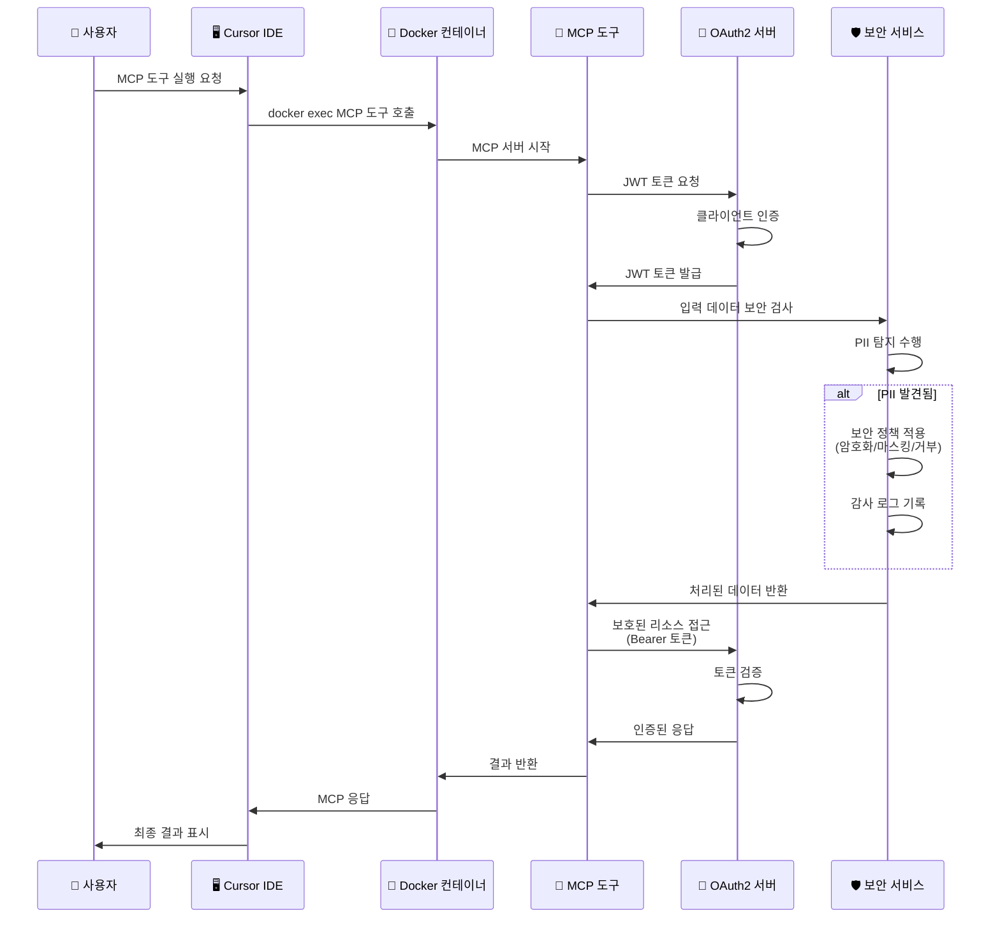

# MCP 도구 실행 플로우

```mermaid
sequenceDiagram
    participant User as 👤 사용자
    participant Cursor as 🖥️ Cursor IDE
    participant Docker as 🐳 Docker 컨테이너
    participant MCP as 🔧 MCP 도구
    participant OAuth as 🔐 OAuth2 서버
    participant Security as 🛡️ 보안 서비스
    
    User->>Cursor: MCP 도구 실행 요청
    Cursor->>Docker: docker exec MCP 도구 호출
    Docker->>MCP: MCP 서버 시작
    
    MCP->>OAuth: JWT 토큰 요청
    OAuth->>OAuth: 클라이언트 인증
    OAuth->>MCP: JWT 토큰 발급
    
    MCP->>Security: 입력 데이터 보안 검사
    Security->>Security: PII 탐지 수행
    
    alt PII 발견됨
        Security->>Security: 보안 정책 적용<br/>(암호화/마스킹/거부)
        Security->>Security: 감사 로그 기록
    end
    
    Security->>MCP: 처리된 데이터 반환
    MCP->>OAuth: 보호된 리소스 접근<br/>(Bearer 토큰)
    OAuth->>OAuth: 토큰 검증
    OAuth->>MCP: 인증된 응답
    MCP->>Docker: 결과 반환
    Docker->>Cursor: MCP 응답
    Cursor->>User: 최종 결과 표시
``` 