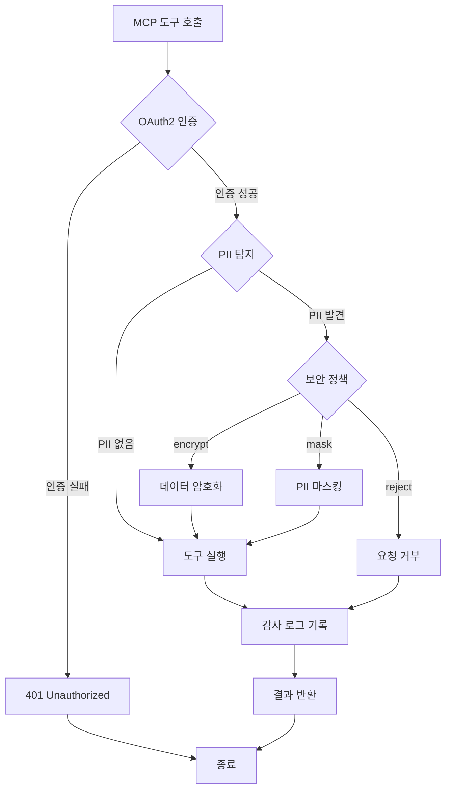

# 보안 처리 플로우

```mermaid
flowchart TD
    Start[MCP 도구 호출] --> Auth{OAuth2 인증}
    Auth -->|인증 실패| AuthFail[401 Unauthorized]
    Auth -->|인증 성공| PII_Check{PII 탐지}
    
    PII_Check -->|PII 없음| Execute[도구 실행]
    PII_Check -->|PII 발견| Policy{보안 정책}
    
    Policy -->|encrypt| Encrypt[데이터 암호화]
    Policy -->|mask| Mask[PII 마스킹]
    Policy -->|reject| Reject[요청 거부]
    
    Encrypt --> Execute
    Mask --> Execute
    Execute --> Log[감사 로그 기록]
    Log --> Response[결과 반환]
    
    Reject --> Log
    AuthFail --> End[종료]
    Response --> End
``` 