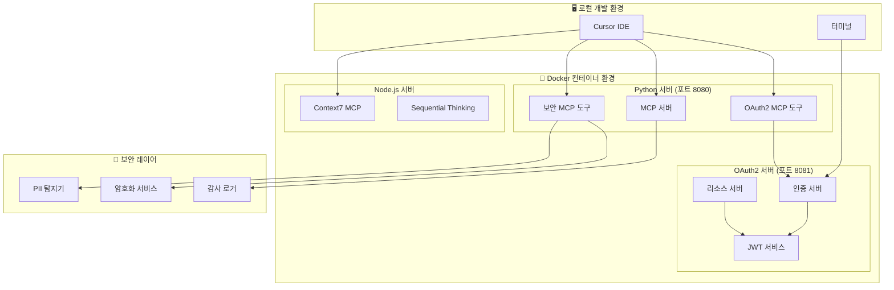

# 전체 시스템 아키텍처

```mermaid
graph TB
    subgraph "🖥️ 로컬 개발 환경"
        Cursor[Cursor IDE]
        Terminal[터미널]
    end
    
    subgraph "🐳 Docker 컨테이너 환경"
        subgraph "Python 서버 (포트 8080)"
            MCP_Server[MCP 서버]
            OAuth2_Tools[OAuth2 MCP 도구]
            Security_Tools[보안 MCP 도구]
        end
        
        subgraph "Node.js 서버"
            Context7[Context7 MCP]
            Sequential[Sequential Thinking]
        end
        
        subgraph "OAuth2 서버 (포트 8081)"
            Auth_Server[인증 서버]
            Resource_Server[리소스 서버]
            JWT_Service[JWT 서비스]
        end
    end
    
    subgraph "🔐 보안 레이어"
        PII_Detector[PII 탐지기]
        Encryption[암호화 서비스]
        Audit_Logger[감사 로거]
    end
    
    Cursor --> MCP_Server
    Cursor --> OAuth2_Tools
    Cursor --> Security_Tools
    Cursor --> Context7
    Terminal --> Auth_Server
    
    OAuth2_Tools --> Auth_Server
    Security_Tools --> PII_Detector
    Security_Tools --> Encryption
    MCP_Server --> Audit_Logger
    
    Auth_Server --> JWT_Service
    Resource_Server --> JWT_Service
``` 